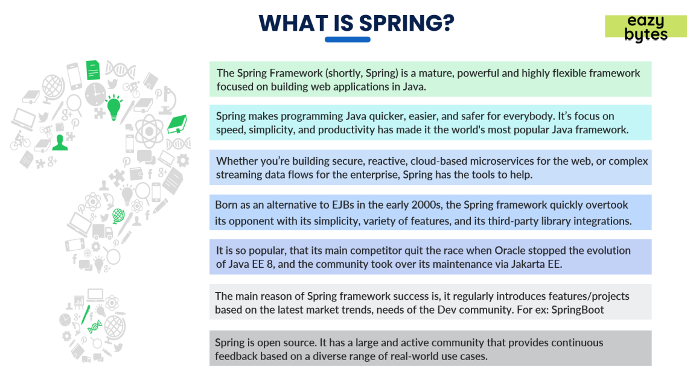

The **Spring Framework** is a comprehensive and widely used open-source framework for building enterprise-grade Java applications. It provides a robust infrastructure that allows developers to focus on the business logic of their applications while taking care of the boilerplate and complex configurations behind the scenes.

### Key Concepts and Components of Spring Framework

#### 1. **Inversion of Control (IoC) and Dependency Injection (DI)**
- **IoC**: The core concept of Spring is the Inversion of Control (IoC). In traditional programming, the flow of control is determined by the developer, but in IoC, control is inverted, meaning the framework manages the flow. This is achieved through Dependency Injection (DI).
- **DI**: With DI, the framework injects dependencies into classes, typically via constructor or setter injection. This promotes loose coupling and enhances testability.

#### 2. **Aspect-Oriented Programming (AOP)**
- **AOP**: This is another key feature of Spring, allowing for the separation of cross-cutting concerns (like logging, security, and transaction management) from the business logic. AOP enables you to define "aspects" that can be applied across different parts of the application without modifying the actual business logic.

#### 3. **Spring Core Container**
- **Spring Core**: This is the core module of the framework, providing the fundamental features such as IoC and DI. It includes the `BeanFactory`, which is the heart of the Spring IoC container.
- **ApplicationContext**: An extension of `BeanFactory` that adds more enterprise-specific functionality, such as event propagation, declarative mechanisms to create a bean, and various ways to look up.

#### 4. **Spring MVC (Model-View-Controller)**
- **Spring MVC**: A web framework within Spring that follows the MVC design pattern. It helps in building web applications by separating the concerns of the model, view, and controller. Spring MVC integrates seamlessly with other frameworks and libraries and can handle RESTful web services.

#### 5. **Spring Data**
- **Spring Data**: Aims to make it easier to implement data access layers. It includes various subprojects to integrate with different data storage solutions, such as Spring Data JPA for relational databases, Spring Data MongoDB for NoSQL databases, etc.

#### 6. **Spring Boot**
- **Spring Boot**: A Spring module that simplifies the setup and development of new Spring applications. It provides default configurations and an embedded server to quickly run applications. Spring Boot also includes powerful features like Spring Boot Actuator for monitoring and managing applications.

#### 7. **Spring Security**
- **Spring Security**: A powerful and customizable authentication and access-control framework. It handles common security concerns in enterprise applications, such as authentication, authorization, and protection against common threats like CSRF, XSS, etc.

#### 8. **Spring Batch**
- **Spring Batch**: A robust framework for developing batch processing applications. It provides features like transaction management, chunk processing, job processing, and support for scheduling and parallel processing.

#### 9. **Spring Cloud**
- **Spring Cloud**: A framework for building distributed systems and microservices. It provides tools to handle common challenges like configuration management, service discovery, circuit breakers, distributed sessions, and more.

#### 10. **Spring Integration**
- **Spring Integration**: Provides a framework for enterprise integration patterns (EIPs), enabling you to build messaging and event-driven architectures. It integrates with other Spring modules and external systems like message brokers and REST services.

### Benefits of Using Spring Framework

1. **Modular Architecture**: The modular nature of Spring allows developers to use only the parts they need without burdening the application with unnecessary dependencies.
2. **Ease of Testing**: The DI principle makes it easy to test the application by injecting mock dependencies.
3. **Integration with Other Frameworks**: Spring integrates well with other popular frameworks like Hibernate, JPA, etc.
4. **Community and Ecosystem**: Spring has a large community and ecosystem, ensuring continued support, regular updates, and a wealth of resources and extensions.
5. **Consistency**: Provides a consistent programming model that spans across different layers of an enterprise application.

### Use Cases of Spring Framework

- **Web Applications**: Spring MVC is widely used for building robust and scalable web applications.
- **Microservices**: Spring Boot and Spring Cloud are popular choices for building and managing microservices architectures.
- **Data Processing**: Spring Batch and Spring Data simplify data processing tasks in enterprise applications.
- **Security**: Applications that require comprehensive security solutions often leverage Spring Security.

### Conclusion

The Spring Framework is a powerful and flexible tool for developing Java-based applications. Its features like IoC, AOP, and comprehensive support for various aspects of application development make it a preferred choice for developers building enterprise-grade applications. Whether you are working on a simple web application or a complex microservices architecture, Spring provides the tools and infrastructure to get the job done efficiently and effectively.